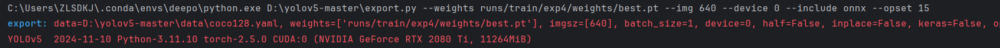
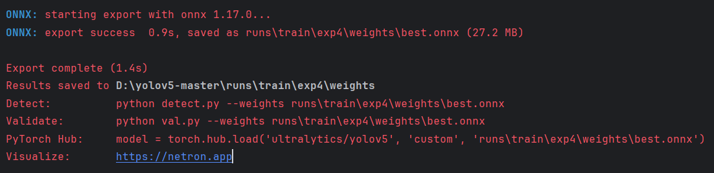
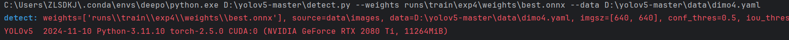
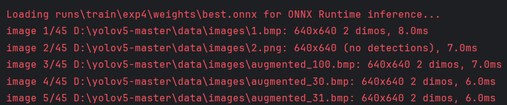
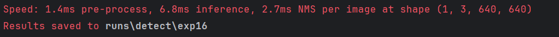

# YOLO调试记录

## data 数据yaml文件配置

```python
path: ../datasets/dimo4
train: D:\yolov5-master\datasets\dimo4\images\train
val: D:\yolov5-master\datasets\dimo4\images\val
test: # test images (optional)
# Classes
names:
  0: dimo
```

## 模型导出

### 命令行形式

```bash
python export.py --weights runs/train/exp4/weights/best.pt --img 640 --batch 1 --device 0 --include onnx --opset 15       
```

weights地址: runs/train/exp4/weights/xxx.pt    路径中的模型为pt文件

在detect.py中batch为1        batch在detect中不能更改 





### PyCharm配置

##### export.py

```bash
--weights
runs/train/exp4/weights/best.pt
--img
640
--device0
--include
onnx
--opset
15
```


## 模型加载

```bash
--weights
runs\train\exp4\weights\best.onnx
--data
D:\yolov5-master\data\dimo4.yaml
```

在detect.py中

输入的模型为在train.py中训练好的模型   ：地址: runs/train/exp4/weights/xxx.pt      

或者 ：runs/train/exp4/weights/xxx.onnx





