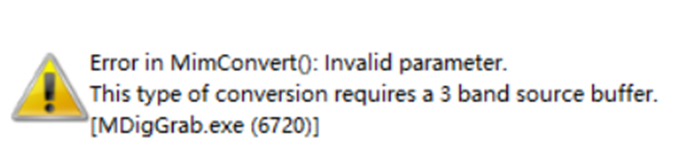
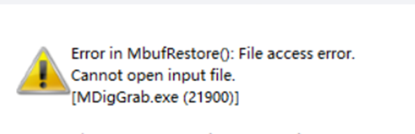

# Matrox 问题整理

## 如何进行模板匹配
问题详情：  如何正确设置匹配方式的参数(文件打不开，参数无效等).

问题回答：

## 模板匹配时模板如何载入
问题详情：如何使用我们自己的rgb图像进行模板匹配（模板和检测图片的导入以及模板的定义），例如一下警告：

问题回答： 

## 如何调用ONNX

问题详情：如何使用加载的onnx执行目标检测和分类任务（如何进行推理）。

另外，
1. onnx模型在gpu上跑还是在CPU上跑
2. 是单个模型处理6个相机的图片，一起拼起来进模型然后出结果快，还是串行的进模型推理快。

问题回答：

# 如何进行Blob分析

问题详情：

问题回答：